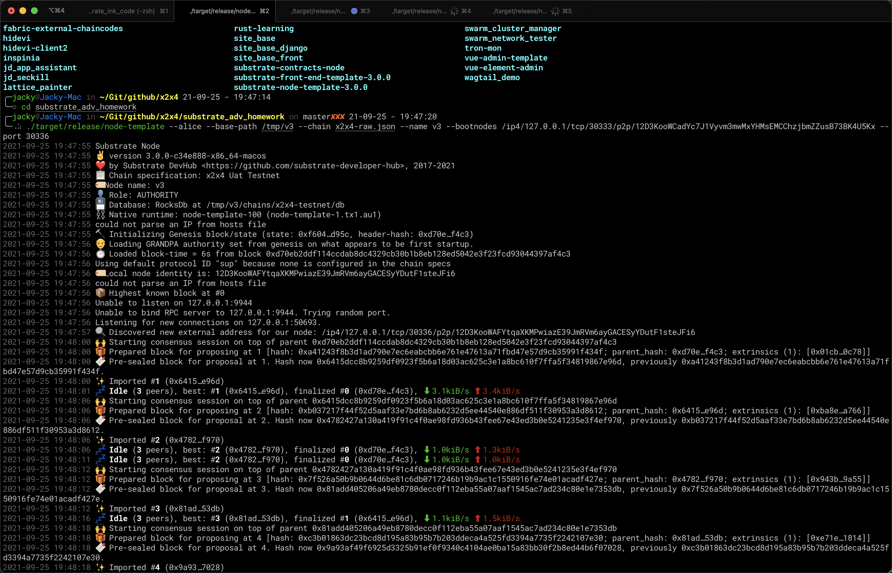

# 第六课的答题1

## 流程

1. Cargo.toml 引入benchmarking， 
2. 添加runtime-benchmarks编译标签

在pallets的模块中引入模块

```rust
mod benchmarking;
pub mod weights;
```

在pallet mod下引入权重结构体

```rust
pub use crate::weights::WeightInfo;
```

在pallet config中，定义权重接口

```rust
type WeightInfo: WeightInfo;
```

在需要测试的方法前面定义权重标签

```rust
#[pallet::weight(T::WeightInfo::方法名字(*参数))]
```

接下来开始编写benchmarking.rs文件

在文件头标记编译标签(与cargo.toml对应)

```rust
#![cfg(feature = "runtime-benchmarks")]
```

引入依赖

```rust
use frame_benchmarking::{benchmarks, account};
```

编写benchmark，下面用do_something举例

```rust
benchmarks!{
	do_something {
		let b in 1 .. 1000;
		let caller = account("caller", 0, 0);
	}: _ (RawOrigin::Signed(caller), b.into())
	verify {
		let value = Something::<T>::get();
		assert_eq!(value, b.into());
	}
}
```

_ (RawOrigin::Signed(caller), b.into()) \_是简写，如果调用的方法名字与宏内定义名称一致就可以简写成\_

这里相当于 do_something (RawOrigin::Signed(caller), b.into())

创建一个权重模板 frame-weight-template.hbs

```bash
mkdir .maintain
cd .maintain
wget 'https://raw.githubusercontent.com/kaichaosun/play-substrate/master/.maintain/frame-weight-template.hbs'
cd -
```

在runtime引入这个模块，注意要实现配置接口

```rust
type WeightInfo = pallet_template::weights::SubstrateWeight<Runtime>;
```

编译node-template !! 这里步骤有点问题，这个编译应该早于修改pallet之前 <-- 好像不对，应该是在pallet目录中执行

```bash
cargo build --features runtime-benchmarks --release
```

生成权重文件

```bash
./target/release/node-template benchmark --chain dev --execution wasm --wasm-execution compiled --pallet pallet_template --extrinsic do_something --steps 20 --repeat 500 --output=./pallets/template/src/weights.rs --template=./maintain/frame-weight-template.hbs
```

总结

实际上只要添加了benchmarking的功能直接跑

```
./target/release/node-template benchmark --chain dev --execution wasm --wasm-execution compiled --pallet pallet_template --extrinsic do_something --steps 20 --repeat 500
```

把平均值*一个上浮比例再写回方法前

```
#[pallet::weight(这里用平均值*1.2*1_000_000 + T::DbWeight::get().writes(1))]
```

## 碰到的问题

1. 本地的node-template必须编译成带benchmark features，否则报错，这一步一定要最先做，因为改了pallet文件后，在没有生成weight.rs文件前，node-template编译会报错的
   
   ```
   Error: Input("Benchmarking wasn't enabled when building the node. You can enable it with `--features runtime-benchmarks`.")
   ```
2. ppt中的`--extrinsic *` 会报奇怪的错误

   ```
   ./target/release/node-template benchmark --chain dev --execution wasm --wasm-execution compiled --pallet pallet_template --extrinsic * --steps 20 --repeat 50
   error: Found argument 'Cargo.toml' which wasn't expected, or isn't valid in this context
   
   USAGE:
       node-template benchmark --chain <CHAIN_SPEC> --execution <STRATEGY> --extrinsic <extrinsic> --pallet <pallet> --wasm-execution <METHOD>

   For more information try --help
   ```
   
3. 老师的template下载下来后，我本地的环境报错
   
   ```
   $ ./target/release/node-template benchmark --chain dev --execution wasm --wasm-execution compiled --pallet pallet_template --extrinsic do_something --steps 20 --repeat 500 --output=./pallets/template/src/weights.rs --template=./maintain/frame-weight-template.hbs
   
   Error: Input("Handlebars template file is invalid!")
   ```

4. 跳过使用template，生成出来的文件结构和老师的不一样，导致pallet文件中的内容不一致
   
   我本地生成的

   ```
   pub struct WeightInfo<T>(PhantomData<T>);
   impl<T: frame_system::Config> pallet_template::WeightInfo for WeightInfo<T> {
       fn do_something(_s: u32, ) -> Weight {
           (21_261_000 as Weight)
           .saturating_add(T::DbWeight::get().writes(1 as Weight))
       }
   }
   ```
   
   老师的pallet例子中，config里面的WeightInfo应该是要一个trait，这里生成了个结构体，手动改成老师的格式编译成功


Benchmarking运行截图


本地测试多机器启动

启动命令

bootnode

```
./target/release/node-template --bob --base-path /tmp/node1 --chain x2x4-raw.json --name bootnode1
```

validator1 

```
./target/release/node-template --charlie --base-path /tmp/v1 --chain x2x4-raw.json --name v1 --bootnodes /ip4/127.0.0.1/tcp/30333/p2p/12D3KooWCadYc7J1Vyvm3mwMxYHMsEMCChzjbmZZusB73BK4U5Kx --port 30334
```

validator2

```
./target/release/node-template --dave --base-path /tmp/v2 --chain x2x4-raw.json --name v2 --bootnodes /ip4/127.0.0.1/tcp/30333/p2p/12D3KooWCadYc7J1Vyvm3mwMxYHMsEMCChzjbmZZusB73BK4U5Kx --port 30335
```

validator3

```
./target/release/node-template --alice --base-path /tmp/v3 --chain x2x4-raw.json --name v3 --bootnodes /ip4/127.0.0.1/tcp/30333/p2p/12D3KooWCadYc7J1Vyvm3mwMxYHMsEMCChzjbmZZusB73BK4U5Kx --port 30336
```


bootnode


验证人1


验证人2


验证人3



